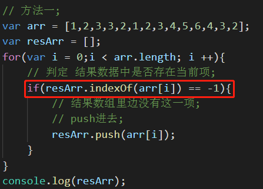
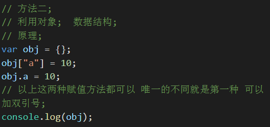
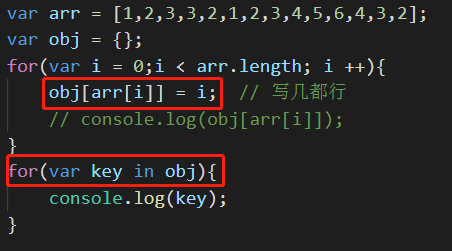

# 面试总结：

面试中碰到的问题做个总结。

## 1. call apply bind区别

call apply更改函数的调用者即this指向，此时 this指向的规则是不变的；

call：接受1~n个参数 ， 第一个参数为更改函数的调用者，其余的参数是从第二个开始和形参一一对应；
apply：接受两个参数 第一个参数为更改函数的调用者 第二个参数为一个数组 相当于arguments 数组里的项和形参一一对应；

bind后带括号 说明返回的是一个新的函数，必须调用才会执行 传参形式与call相同

## 2. constructor || __proto__ || prototype 之间的区别

constructor 指向创建自己的构造函数；

每个函数之中都会有一个prototype 指向原型对象；

__proto__ 原型指针；指向构造自己的那个原型对象；

## 3. ES7 新特性

1、求幂运算符 ( ** )
    
2、Array.prototype.includes()方法
查找一个值在不在数组里，若在，则返回true，反之返回false

两个参数：要搜索的值和搜索的开始索引，当第二个参数被传入时，该方法会从索引处开始往后搜索（默认搜索值为0）

3、函数作用域当中严格模式的变更

## 4. ES8 新特性

异步函数：

Promise的写法只是回调函数的改进，使用then方法，只是让异步任务的两段执行更清楚而已。Promise的最大问题是代码冗余，请求任务多时，一堆的then，也使得原来的语义变得很不清楚。此时我们引入了另外一种异步编程的机制：Generator。
Generator 函数是一个普通函数，但是有两个特征。一是，function关键字与函数名之间有一个星号；二是，函数体内部使用yield表达式，定义不同的内部状态（yield在英语里的意思就是“产出”）

## 5. http1.1 存在的问题

1. TCP连接数限制
    对于同一个域名，浏览器最多只能同时创建6~8 个TCP连接 为了解决数量限制 出现了域名分片技术 就是资源分域

2. 线头阻塞的问题
    每个TCP链接同时只能处理一个请求-响应，按照浏览器的FIFO原则处理请求，如果上一个响应没有返回 后续的请求-响应都会受阻。为了解决此问题 出现了管线化技术；

## 6. js 三大组成部分

1、ECMAScript是一种规范

2、BOM 浏览器事件模型

3、DOM 文档对象模型

## 7. jsonp的优缺点

优点：  
	1. 它不像XMLHttpRequest对象实现的Ajax请求那样受到同源策略的限制，JSONP可以跨越同源策略；  
	2. 它的兼容性更好，在更加古老的浏览器中都可以运行，不需要XMLHttpRequest或者ActiveX的支持；  
	3. 在请求完毕后可以通过调用callback的方式回传结果。将回调方法的权限给了调用方。  

缺点：  
	1. 只支持get请求而不支持post等其他类型的http请求  
	2. 只支持跨域http请求这种情况，不能解决不同域的两个页面之间如何进行javascript调用的问题   
	3. jsonp在调动失败的时候不会返回各种http状态码  
	4. 安全性 假如提供jsonp的服务存在页面注入漏洞，即他返回的javascript内容是容易被人控制的。那么结果是所有调用这个jsonp的网站都会存在漏洞。  

所以在使用jsonp的时候一定要保证使用的jsonp服务是安全可靠的；  

## 8. 继承
 
继承：  
分两种：  
构造函数继承：创建一个对象将想要继承的对象和方法放进去；  
实现：call apply 更改this的指向 直接更改父级的this指向当前的调用者  

原型继承：每个构造函数 都有一个原型对象 而原型有个特性 在for in 的时候会隐藏掉两个属性 constructor __proto__所以我们for in 到的只是自己添加的属性和方法；所以此时我们就可以将父级的prototype直接通过for in给子级；  

## 9. 内存泄漏 实现延迟加载的方式

什么是内存泄漏？  
内存泄漏可以定义为：应用程序不需要占用内存的时候，内存没有被系统回收或可用内存池回收。  

内存泄漏出现的几种情况  
JavaScript·是一种垃圾回收语言。  

1、意外的全部变量污染。  
解决方式：使用use strict严格模式，避免意外的全局变量，或者解除引用，令其=null.  
2、被遗忘的定时器或回调函数  
定时器无法随着函数的结束而停止，所以要要停止定时器从而使定时器从内存中清理出去  
3、脱离DOM的引用  
假如你的代码中保存了表格某一个td的引用，当你决定删除整个表格的时候，直觉认为会回收除了已保存的td意外的其他节点，实际情况是td是表格的子节点，子元素和父元素是引用关系，由于代码保存了td的引用，导致整个表格仍待在内存中。  
4、闭包  
解除引用  

JS  延迟加载的方式  
1、defer属性   和async一样都是写在scrip标签上比如
```
<script defer='defer'>  
```
2、async属性  
3、动态创建DOM方式  
4、jQuery的getScript（）方法  
5、使用setTimeout延迟  
6、把JS放到页面底部，让JS最后引入  

## 10. 判断一个数据类型是什么类型的
```
object.prototype.toString().call
```

## 11. 输入www.baidu.com会发生什么

1、域名解析  
2、找到相对应的服务器  
3、找到相对应的资源  
4、返回相对应的资源  
5、浏览器对资源进行解析，比如html，js，css，img，将会再次找到对应的服务器，找到资源并返回  
6、返回到客户端  

## 12. 伪数组转真数组

原生四种方法：  

1、最简单的 声明一个空数组 通过遍历伪数组把他们添加到新的数组中种 （不是面试官要的 大家都会）；  
2、使用数组的slice方法 它返回的数组 使用call 或者 apply指向伪数组；  
3、使用原型继承；
```
li.__proto__ = Array.prototype；
```
4、ES6数组的新方法：Array.from()；  
缺点 兼容性不好；

## 13. AMD/CMD区别

AMD 是 RequireJS 在推广过程中对模块定义的规范化产出。  
CMD 是 SeaJS 在推广过程中对模块定义的规范化产出。  
类似的还有 CommonJS Modules/2.0 规范，是 BravoJS 在推广过程中对模块定义的规范化产出。  

区别：  

1. 对于依赖的模块，AMD 是提前执行，CMD 是延迟执行。不过 RequireJS 从 2.0 开始，也改成可以延迟执行（根据写法不同，处理方式不同）。CMD 推崇 as lazy as possible.
2. CMD 推崇依赖就近，AMD 推崇依赖前置。
3. AMD 的 API 默认是一个当多个用，CMD 的 API 严格区分，推崇职责单一.

## 14. CSRF攻击原理及防御

CSRF全名是Cross-site request forgery，是一种对网站的恶意利用，CSRF比XSS更具危险性。  
先了解session: 咖啡店的会员卡 会员卡卡号相当于sessionId 保存到cookie之中;  
CSRF攻击：复制了会员卡信息，去消费，享受会员待遇，而我在月底收到账单。  
例子：  CSRF攻击的主要目的是让用户在不知情的情况下攻击自己已登录的一个系统，类似于钓鱼。如用户当前已经登录了邮箱，或bbs，同时用户又在使用另外一个，已经被你控制的站点，我们姑且叫它钓鱼网站。这个网站上面可能因为某个图片吸引你，你去点击一下，此时可能就会触发一个js的点击事件，构造一个bbs发帖的请求，去往你的bbs发帖，由于当前你的浏览器状态已经是登陆状态，所以session登陆cookie信息都会跟正常的请求一样，纯天然的利用当前的登陆状态，让用户在不知情的情况下，帮你发帖或干其他事情。

防御：  
通过 referer、token 或者 验证码 来检测用户提交。  
尽量不要在页面的链接中暴露用户隐私信息。  
对于用户修改删除等操作最好都使用post 操作 。  
避免全站通用的cookie，严格设置cookie的域。  

## 15. 前端安全之XSS

XSS, 即为（Cross Site Scripting）, 中文名为跨站脚本, 是发生在目标用户的浏览器层面上的，当渲染DOM树的过程成发生了不在预期内执行的JS代码时，就发生了XSS攻击。  

XSS攻击方式：  

1. 反射型 XSS  
反射型XSS，也叫非持久型XSS，是指发生请求时，XSS代码出现在请求URL中，作为参数提交到服务器，服务器解析并响应。响应结果中包含XSS代码，最后浏览器解析并执行。
如果是黑客的话，他们会注入一段第三方的js代码，然后将获取到的cookie信息存到他们的服务器上。这样的话黑客们就有机会拿到我们的身份认证做一些违法的事情了。

2. 存储型 XSS
存储型XSS，也叫持久型XSS，主要是将XSS代码发送到服务器（不管是数据库、内存还是文件系统等。），然后在下次请求页面的时候就不用带上XSS代码了。
最典型的就是留言板XSS。用户提交了一条包含XSS代码的留言到数据库。当目标用户查询留言时，那些留言的内容会从服务器解析之后加载出来。浏览器发现有XSS代码，就当做正常的HTML和JS解析执行。XSS攻击就发生了。

3. DOM XSSDOM XSS攻击不同于反射型XSS和存储型XSS，DOM XSS代码不需要服务器端的解析响应的直接参与，而是通过浏览器端的DOM解析。这完全是客户端的事情。
DOM XSS代码的攻击发生的可能在于我们编写JS代码造成的。我们知道eval语句有一个作用是将一段字符串转换为真正的JS语句，因此在JS中使用eval是很危险的事情，容易造成XSS攻击。避免使用eval语句。

XSS危害：  

通过document.cookie盗取cookie  
使用js或css破坏页面正常的结构与样式  
流量劫持（通过访问某段具有window.location.href定位到其他页面）  
Dos攻击：利用合理的客户端请求来占用过多的服务器资源，从而使合法用户无法得到服务器响应。  
利用iframe、frame、XMLHttpRequest或上述Flash等方式，以（被攻击）用户的身份执行一些管理动作，或执行一些一般的如发微博、加好友、发私信等操作。  
利用可被攻击的域受到其他域信任的特点，以受信任来源的身份请求一些平时不允许的操作，如进行不当的投票活动。  

XSS防御：  

1. 对cookie的保护：对重要的cookie设置httpOnly, 防止客户端通过document.cookie读取cookie。服务端可以设置此字段。  
2. 对用户输入数据的处理：
编码：不能对用户输入的内容都保持原样，对用户输入的数据进行字符实体编码。对于字符实体的概念可以参考文章底部给出的参考链接。  
解码：原样显示内容的时候必须解码，不然显示不到内容了。  
过滤：把输入的一些不合法的东西都过滤掉，从而保证安全性。如移除用户上传的DOM属性，如onerror，移除用户上传的Style节点，iframe, script节点等。  

## 16. https

https 是 http 的加密版本 是在http的基础上 采用ssl进行加密传输；  
用途： 加密数据，反劫持，SEO  
如何开启： 生成私钥与证书，配置nginx，重启nginx看效果；  

## 17. 数组去重

1. 方法一：利用indexOf();  


2. 方法二：利用对象;  
  
  
打印结果如下：相同的值被覆盖  
  
  
  

3. 方法三：一句话去重;  
  

