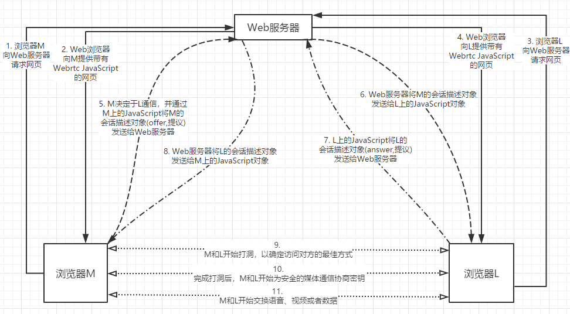

# WebRTC

研究webrtc这一块也有一段时间了，  
做一个总结吧。  

### 是什么?

Web的实时通信技术, 支持网页浏览器进行实时音视频对话的API, 而不需要安装插件。  
Webrtc提供视频会议的核心技术, 包括音视频采集、编解码、网络传输、显示等功能, 而且也支持跨平台。  

webrtc中文文档地址: [webrtc中文文档-MDN](https://developer.mozilla.org/zh-CN/docs/Web/API/WebRTC_API)  
webrtc官网地址: [webrtc官网(需要翻墙)](https://webrtc.org)  
    Developer ==> Getting started 之中会有很多Demos and samples可以帮助你更快的上手;  

书籍的话比较经典的一本: 《WebRTC权威指南》  

需要搞懂的也是我一直比较混的几个概念:  

1. 信令：有时候我们会将浏览器和服务器之前的连接称之为信令，但并非电话系统中所用的信令。信令在webrtc之中并未标准化, 因为它只是被视为应用程序的一部分。信令可以通过http或者webSocket传送到向浏览器提供HTML页面的同一Web服务器，也可传送到只负责处理信令的一个完全不同的Web服务器。  

2. 媒体协商：通信会话中的双方(例如两个浏览器)进行通信并就可接受的媒体会话达成一致的过程。  
"提议/应答"就是一种媒体协商方式。

### 怎么用?

#### 建立WebRTC会话

   1. 获取本地媒体;  ==>  getUserMedia()
   2. 在浏览器和对等端(其他浏览器或者终端)之间建立连接;  ==>  RTCPeerConnection()  包含ICE"打洞"通过各种网络地址转换设备和防火墙时使用的信息;
   3. 将媒体和数据通道关联至该连接;  ==>  RTCSessionDescription()
   4. 交换会话描述。  ==> SDP会话描述协议;
    

